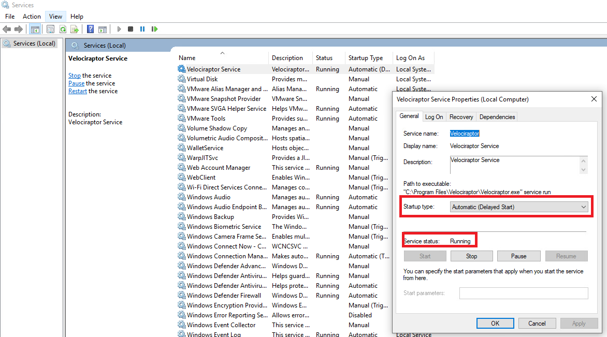

# 🪟 Setting up a Windows Client

### Installation

On the windows workstation: Create a new folder for <mark style="color:green;">Velociraptor</mark> in `C:\Programfiles\`

Download the latest windows-amd64.msi file from the <mark style="color:green;">Velociraptor</mark> GitHub: [https://github.com/Velocidex/velociraptor/releases](https://github.com/Velocidex/velociraptor/releases) to `C:\Programfiles\Velociraptor`

During deployment a file named `client.config.yaml` was created on the Server. SCP this file to `C:\Programfiles\Velociraptor`and rename it to "Velociraptor.config.client".&#x20;

Run the MSI file:

Verify that the <mark style="color:green;">Velociraptor</mark> service is working by opening Windows _services.msc_ and ensure that "<mark style="color:green;">Velciraptor Service</mark>" is running and set to startup automatically.&#x20;

The <mark style="color:green;">Velociraptor</mark> Admin GUI at <mark style="color:blue;">`https://SERVER-IP:8889/`</mark>will dynamically update with the new client machine. At the top left of the Admin GUI is a search bar. The newly added client can be seen by searching for their hostname using the search query <mark style="color:blue;">`host:hostname`</mark>or by clicking the drop down menu to the right, then clicking "Show All".

#### Running clients interactively

<mark style="color:green;">**Velociraptor**</mark> can also be run as an executable. Note that this is purely for testing and shouldn't be used in an actual production environment.&#x20;

Create this directory: <mark style="color:blue;">`C:\Program Files\Velociraptor`</mark>

Then, download the latest windows executable file then run this command with the client config file:

<mark style="color:blue;">`velociraptor --config client.config.yaml client -v`</mark>
