# 🦖 Hunting for Mespinoza/Pysa

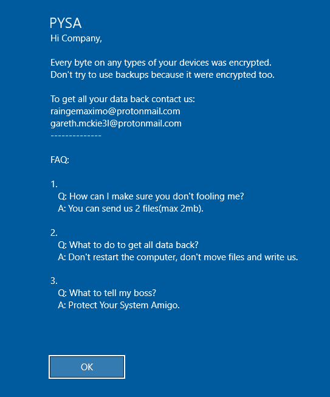


## Beginning the Investigation

Before starting any investigations it is important to quarantine the client.  For more information visit the "Navigating Clients" page linked below:


[navigating-clients.md](../../using-velociraptor/navigating-clients.md)


### Generate Data

The following txt file contains powershell code that will create two files: <mark style="color:blue;">EnNoB-X.exe</mark> and a <mark style="color:blue;">README</mark> file.&#x20;

Download the file and edit the following field to a known user on the box:

<mark style="color:blue;">`$readme = "C:\Users\champuser\Desktop\Readme.READ"`</mark>

The rename it to: <mark style="color:blue;">`step1.ps1`</mark> and execute the script to generate data



### Initial Scan

After the host has been quarantined, the client will automatically be labeled as "quarantine". Use this label when selecting where the Hunt will take place.

.PNG>)

Next, select the "Windows.Search.FileFinder" artifact.&#x20;

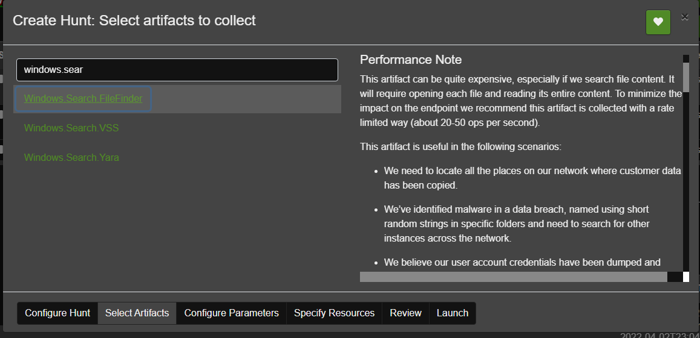

Delete the default inputs for "SearchFilesGlob" and "SearchFilesGlobTable".&#x20;

Then add the attack methods and .pysa files outlined in the Intell report as shown in the screenshot below.&#x20;


The syntax for the Glob parameters is like this:\
<mark style="color:blue;">`C:/**/someFilename`</mark> or <mark style="color:blue;">`C:/**/*.someExtension`</mark>

The "\*" is used when the file path or filename is unknown. <mark style="color:blue;">`C:/**/`</mark> will parse through every folder reclusively until it finds a file that matches the given name or extension.

Make sure to click "Upload\_File" to gain additional information and ensure the collected evidence is downloadable.


NOTE: The "EnNoB-X.exe" files are not included in this <mark style="color:green;">Hunt</mark>. Regular Expression is needed in order to hunt for those files, which is included in another <mark style="color:green;">Artifact</mark>. See section: [Finding Additional Evidence.](hunting-for-mespinoza-pysa.md#finding-additional-evidence)


After the <mark style="color:green;">Hunt</mark> has completed, navigate to the notebooks tab and click the left most icon above the display table:


This elevates a new menu. Now click the icon that looks like a pencil to open up the raw notebook code:


This opens up the default notebook code:


Edit the <mark style="color:green;">VQL</mark> query to exclude the default "svchost.exe" locations as shown in the code block below. This <mark style="color:blue;">`WHERE`</mark> statement is appended between the <mark style="color:blue;">`SELECT`</mark> and <mark style="color:blue;">`LIMIT`</mark> statements. See the screenshot blow the following code block for reference.

```sql
WHERE FullPath != "C:\\Windows\\System32\\svchost.exe" AND
FullPath != "C:\\Windows\\WinSxS\\amd64_microsoft-windows-services-svchost_31bf3856ad364e35_10.0.17763.1_none_a68143865d7729e1\\svchost.exe" AND
FullPath != "C:\\Windows\\WinSxS\\wow64_microsoft-windows-services-svchost_31bf3856ad364e35_10.0.17763.1_none_b0d5edd891d7ebdc\\svchost.exe" AND
FullPath != "C:\\Windows\\SysWOW64\\svchost.exe"
```

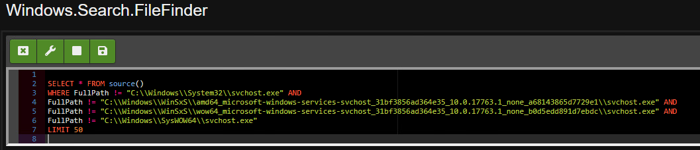

Click the save icon to make the changes go into affect. This is the right most icon that displays a floppy disk:

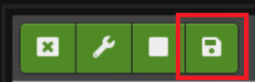

The results are now limited to show only out of place "svchost.exe" files such as in the following screenshot:

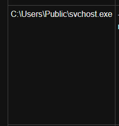

The notebook table can be limited to show only useful information.&#x20;


The following method of attack was found on the ransomed machine that was investigated for  this tutorial. Note the file path and the time fields.

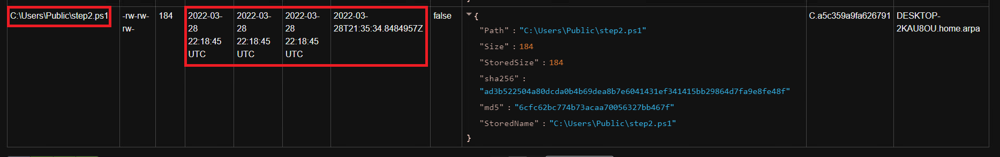

The contents of the file can be previewed by using the remote shell feature of <mark style="color:green;">Velociraptor</mark>.&#x20;

 (1).png>)

This is an example of what files encrypted by the pysa ransomware might look like:

.PNG>)

### Follow Up Scan

The search can be made more specific by searching for files within <mark style="color:blue;">`C:\Users\Public\`</mark> that were modified around the time of attack. See the screenshot below for example:


Limit the table to not show directories.


This might reveal other parts of the attack that were not accounted for by the initial scan


From the **Host Information** page, Hunt results can be downloaded as a zip file that contains all the collected files.


An html report file can be downloaded from the same menu.

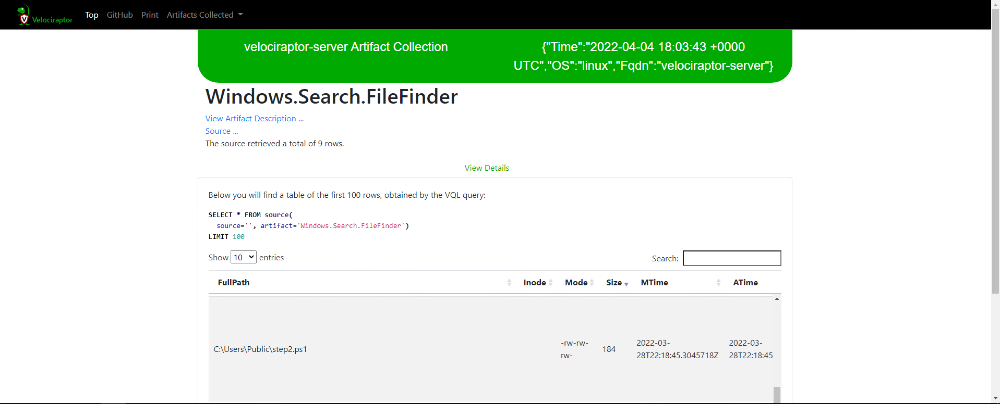

### Finding Additional Evidence

The legal notice can be found by using the VFS on the client and then going into the Windows Registry. The registry path in the Intell Report was: <mark style="color:blue;">`SOFTWARE\Microsoft\Windows\CurrentVersion\Policies\System`</mark>

To get to get the SOFTWARE folder, open the <mark style="color:blue;">`registry`</mark> folder, then <mark style="color:blue;">`HKEY_LOCAL_MACHINE`</mark>

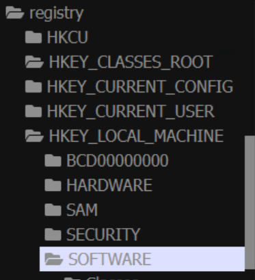

If results are not populating, then click the refresh icon next to sidebar, as shown below:

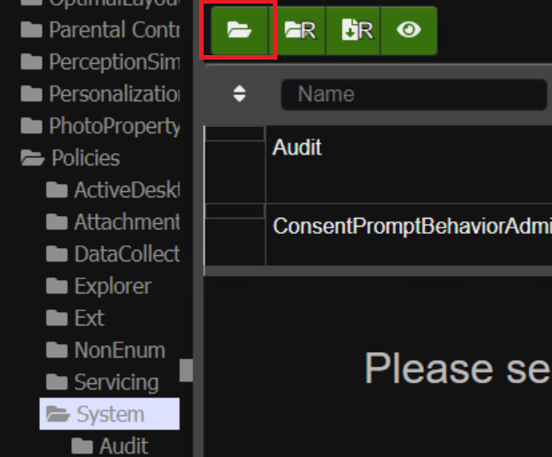


BE CAREFUL NOT TO CLICK THE ICONS WITH THE LETTER "R". These buttons will recursively open file content and could slow down the GUI.&#x20;


The screenshot below is an example of the <mark style="color:blue;">`legalnoticetext`</mark> file. The caption file is located just above it:

.PNG>)

This can be  downloaded by clicking "Collect from the client" and then "download" on the Status menu.


The "EnNoB-X.exe" file is usually deleted in the attack. However, this can be searched for using the "Windows.NTFS.MFT" artifact and Regular Expression, as shown below:

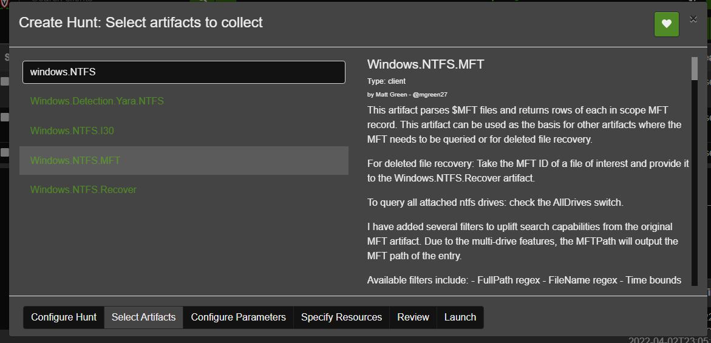

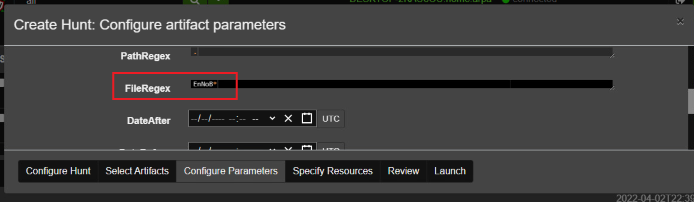
