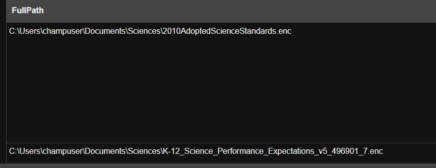
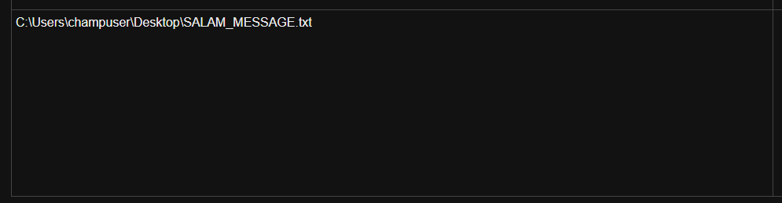
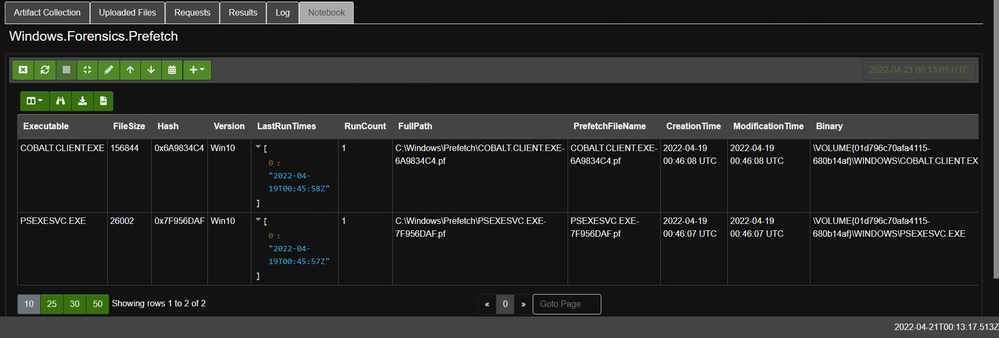
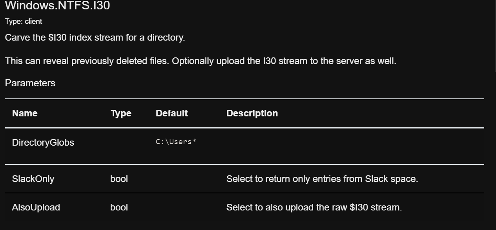
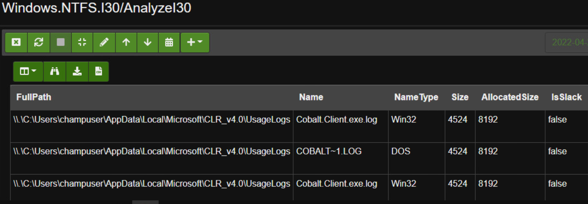

# 🦖 Hunting for Pay2Key Ransomware

### Locating the Ransom and Encrypted Files

Filenames may deviate from how they are documented in Threat Intell reports. For this reason it's a good idea to read multiple reports and pluck out some text that looks like it won't change and use that as the search criteria. In this lesson, the Intell report was built from three separate reports.

#### The search query

Using the same Windows finder artifact from Lesson 1, create a search query that uses the default ransom and encryption naming schemes, as well as some variations. See the screenshot below for example:


These were the ransom and encrypted files that were found using these parameters:




It's a good idea to note the modification time of these files to start building an attack timeline.





See how the attacker used the ".enc" extension and the default ransom name?&#x20;


Now onto <mark style="color:green;">hunting</mark> for the attack method. In the last lesson it was presumed that the attacker was using an older version of the Pysa ransomware, and as a result had left their attack methods behind. Lesson 2 is a bit different.

### Q:  How can an investigator find evidence of an attack,  if an attacker deletes their attack files?


HINT: Take a look at the previous lesson and how the EnNoB\* file metadata was recovered.


A: <mark style="color:green;">Hunt</mark> for evidence of execution!

### Windows Prefetch Files

When a Windows computer is turned on, Windows keeps track of the way the system starts and which programs are commonly open. Windows saves this information as a number of small files in the prefetch folder. The next time the computer is turned on, Windows refers to these files to help speed the start process.

#### Scanning for Prefetch Files

Begin a hunt using the `Windows.Forensics.Prefetch` <mark style="color:green;">artifact</mark>.


Keep the parameters at default but it is a good idea to narrow the timeline to be around the time of the suspected attack.



Consider what this glob parameter is searching for and why it shouldn't be altered.


#### Narrow the results with VQL

Often times filenames deviate from their default naming schemes documented in Threat Intell Reports. The solution: wildcards. A wildcard character is used to substitute one or more characters in a string and is represented by an <mark style="color:blue;">`*`</mark> and the end of the filename. Remember the `EnNoB` <mark style="color:green;">hunt</mark> from Lesson 1?

The operand <mark style="color:blue;">`~`</mark> <mark style="color:blue;"></mark><mark style="color:blue;"></mark> can be appended to the end of an <mark style="color:blue;">`=`</mark> <mark style="color:blue;"></mark><mark style="color:blue;"></mark> to allow for wildcards. See the example <mark style="color:green;">VQL</mark> query below:

```sql
WHERE Executable =~ 'psexec*' OR Exectuable =~ 'cobalt*'
```


Now consider the following screenshot. See how it limits the results to only find methods of attack?



### Q: Would Windows keep track of recently deleted attack files?

A: Yes. There are multiple ways Windows keeps record of deleted files. One of these is the $I30 stream, which <mark style="color:green;">**Velociraptor**</mark> has an <mark style="color:green;">artifact</mark> for.

### NTFS and I30

NTFS is the standard Windows filesystem. In NTFS, all files are represented in a [Master File Table (MFT)](https://docs.microsoft.com/en-us/windows/win32/fileio/master-file-table). As demonstrated throughout this course, <mark style="color:green;">**Velociraptor**</mark> is able to parse NTFS to find metadata called File Attributes. One of these attributes is I30 which contains information that pertains to directory listings.&#x20;

### Windows.NTFS.I30

Using the <mark style="color:green;">artifact</mark> <mark style="color:green;"></mark><mark style="color:green;">****</mark> `Windows.NTFS.I30`, <mark style="color:green;">**Velociraptor**</mark> is able to carve the $I30 index stream for a directory and potentially reveal deleted files.&#x20;



Begin a <mark style="color:green;">Hunt</mark> using this <mark style="color:green;">artifact</mark> using the default query of <mark style="color:blue;">`C:\Users*`</mark>.&#x20;

This <mark style="color:green;">artifact</mark> is only capable of searching through one glob parameter at a time. If an investigation suggest there would be files located in a different directory,  then run multiple hunts to search through each suspected directory.&#x20;

One way to get an idea of where to  search is by looking at the execution locations in the Prefetch Files. For example:&#x20;



WARNING: DO NOT RUN THIS HUNT AGAINST THE ENTIRE WINDOWS SYSTEM (I.e. C:\\\*). Files are deleted and created all the time by Windows in its day to day functionality. Running a Hunt at this scale could cause issues.


Results revealed log files in the <mark style="color:blue;">`AppData`</mark> directory of the targeted user.



Previously deleted Prefetch Files were also discovered:


