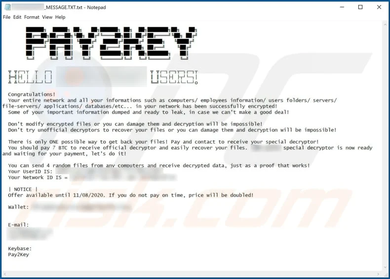
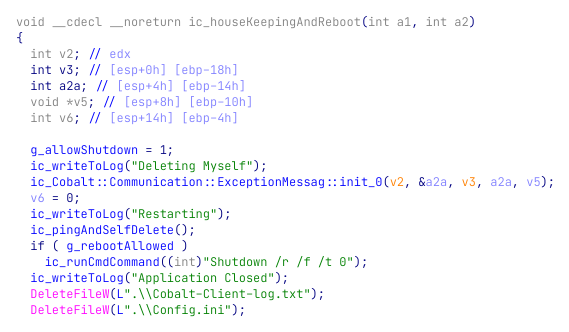

# ℹ Pay2Key Ransomware Intell

In the Fall of 2020, an exceptional number of Israeli companies reported ransomware attacks. Several large corporations experienced a full blown attack with a previously unknown ransomware variant named: **Pay2Key**. The attacker followed the same procedure to gain a foothold, propagate and remotely control the infection within the compromised companies.

**Key findings:**

1. Previously unknown ransomware dubbed Pay2Key, carries targeted attacks against Israeli companies
2. Initial infection is presumably made through RDP connection
3. Lateral movement is made using psexec.exe to execute the ransomware on the different machines within the organization.
4. Special attention was given to the design of the network communication, in order to reduce the noise a large number of encrypted machines may generate while contacting the Command and Control servers.
5. The encryption scheme is solid – using the AES and RSA algorithms.

### What is Pay2Key?

Pay2Key is ransomware written in the C++ programming language compiled using MSVC++ 2015 that encrypts files with [AES and RSA](https://www.pcrisk.com/internet-threat-news/10449-cryptography-and-ransomware) cryptography algorithms. It heavily relies on Object-Oriented Programming and uses well-designed classes for its operation. It also makes use of 3rd-party libraries like the popular libraries of Boost.

&#x20;It renames files by appending the "**.pay2key**" extension. Each ransom message is named after the attacked company (e.g., "<mark style="color:blue;">`[ORGANIZATION]-MESSAGE.TXT`</mark>"). The default values for these are "**.enc**" and "**SALAM-MESSAGE.TXT**" respectively.&#x20;

Research shows that cyber criminals behind Pay2Key create customized ransom messages. To be more precise, different companies are instructed to pay different sums of cryptocurrency.

### Attack Methodology

The attack started by manually accessing one of the machines on the victim’s network, likely via RDP. The attacker copied and created multiple files on the machine, including:

* <mark style="color:blue;">Cobalt.Client.exe</mark> – Pay2Key ransomware
* <mark style="color:blue;">Config.ini</mark> – A configuration file that specifies “Server” and “Port”
* <mark style="color:blue;">ConnectPC.exe</mark> – Pivot / Proxy server

| File Name         | Hash                                                             |
| ----------------- | ---------------------------------------------------------------- |
| Cobalt.Client.exe | 5bae961fec67565fb88c8bcd3841b7090566d8fc12ccb70436b5269456e55c00 |

```cpp
$ diec Cobalt.Client.exe 
PE: compiler: Microsoft Visual C/C++(2015 v.14.0)[-]
PE: linker: Microsoft Linker(14.0, Visual Studio 2015 14.0*)[EXE32,console]

$ rabin2 -I Cobalt.Client.exe | grep "compiled\|pdb"
compiled Mon Oct 26 12:37:49 2020
dbg_file F:\2-Sources\21-FinalCobalt\Source\cobalt\Cobalt\Cobalt\Win32\Release\Client\Cobalt.Client.pdb
```

After the creation of these files on the infected machine, the attackers execute <mark style="color:blue;">`ConnectPC.exe`</mark>. Then, they copied or downloaded the [PsExec](https://docs.microsoft.com/en-us/sysinternals/downloads/psexec) utility and used it to remotely execute the ransomware on other machines in the organization. In order to work properly, the ransomware requires a config file to be located in the same working directory. Thus, <mark style="color:blue;">`Config.ini`</mark> is required to be dropped in the victim’s computer along with <mark style="color:blue;">`Cobalt.Client.exe`</mark>. The Pay2Key ransomware was executed from paths of this template: <mark style="color:blue;">`C:\Windows\Temp\[organization-name]tmp\Cobalt.Client.exe`</mark>

The configuration file that was used in the attack looked like this:

```ini
[Config]
Server = <internal IP address>
Port = 5050
```

Upon execution, Pay2Key is reading the Server and Port keys from the configuration file. If a configuration file was not found in the current working directory and wasn’t supplied in the command line arguments with  <mark style="color:blue;">`--config [path]`</mark> , the ransomware will write “no config file found” to a file at <mark style="color:blue;">`.\Cobalt-Client-log.txt`</mark>. This log file will be used extensively by the ransomware during its execution. Newer versions of the ransomware are making sure to remove this log file from the disk. The full list of supported log messages can be found in the appendix section of this article.

It then initializes the main class of the program, <mark style="color:blue;">`Cobalt::DataProcessing::RansomwareEngine`</mark>, followed by initialization of other important classes that are responsible, among other things, for communication, message handling, managing files and encryption.

Pay2Key generates a pair of RSA keys and sends the public key to the server over raw TCP. The keys will be used to set up secure communication between the ransomware and the server. After sending the key, the ransomware will wait for messages from the server. These messages are parsed and handled by a custom Message Handler

### Ransom Demand <a href="#f2e8766c-e8ab-489e-af2f-b996bbe3cc24" id="f2e8766c-e8ab-489e-af2f-b996bbe3cc24"></a>

After successful encryption, the ransomware drops a ransom note to the system, customized to the targeted corporation in the form of <mark style="color:blue;">`[ORGANIZATION]_MESSAGE.TXT`</mark>. The ransom amount ranges between 7 and 9 Bitcoins.



### Evolution

In the latest version of the ransomware, the attackers added a Self Killing mechanism, in addition to a new command-line argument <mark style="color:blue;">`--noreboot`</mark>.

The new “housekeeping” mechanism is responsible for removing the files created by the attacker and restarting the machine.



**Sources:** [https://www.pcrisk.com/removal-guides/19344-pay2key-ransomware](https://www.pcrisk.com/removal-guides/19344-pay2key-ransomware), [https://research.checkpoint.com/2020/ransomware-alert-pay2key/](https://research.checkpoint.com/2020/ransomware-alert-pay2key/), [https://www.clearskysec.com/wp-content/uploads/2020/12/Pay2Kitten.pdf](https://www.clearskysec.com/wp-content/uploads/2020/12/Pay2Kitten.pdf)
