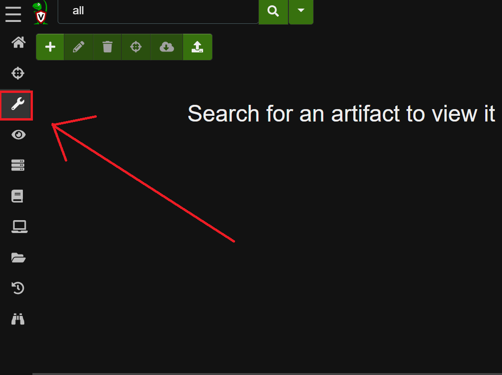
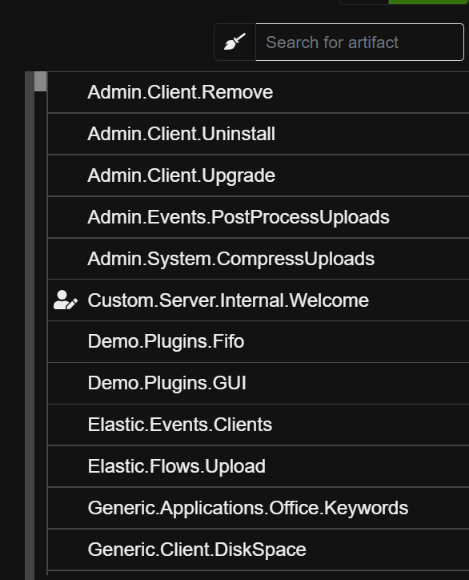

# 🦴 Artifacts

### What is an Artifact?

<mark style="color:green;">**VQL**</mark> queries can be packages inside of mini-programs known as <mark style="color:green;">**Artifacts**</mark>. These are structured like YAML files and contain a query and a name attached to that query. This allows an investigator to search for a query by its name or description and simply run the query on the endpoint rather than needing to type the query into the UI.

### Viewing Artifacts

<mark style="color:green;">**Artifacts**</mark> can be viewed at anytime by accessing the **View Artifacts** page from the sidebar:



On the right side of this page is a search bar and menu. All installed <mark style="color:green;">**Artifacts**</mark> can be found, viewed, and edited from here.



&#x20;Below is an example <mark style="color:green;">**Artifact**</mark> file from the official documentation:

```yaml
name: Custom.Artifact.Name
description: |
   This is the human readable description of the artifact.

type: CLIENT

parameters:
   - name: FirstParameter
     default: Default Value of first parameter

sources:
  - name: MySource
    precondition:
      SELECT OS From info() where OS = 'windows' OR OS = 'linux' OR OS = 'darwin'

    query: |
      SELECT * FROM info()
      LIMIT 10
```

Learn more about <mark style="color:green;">**Artifacts**</mark> and it's parameters here: [https://docs.velociraptor.app/docs/vql/artifacts/](https://docs.velociraptor.app/docs/vql/artifacts/)

### Creating new Artifacts

From the **View Artifacts** page, click the "+" icon on the left:


This opens ups a pop-up with the default <mark style="color:green;">**Artifact**</mark> code:



Don't forget to save the Artifact when done

