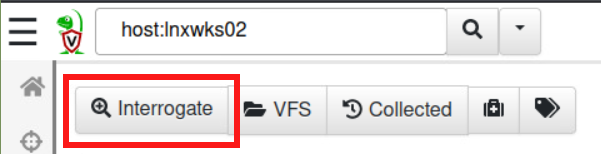
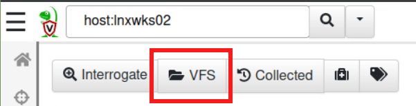
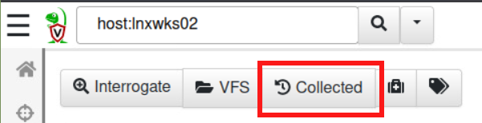

# 🧭 Navigating Clients

### Searching for Clients

At the top left of the of the <mark style="color:green;">Velociraptor</mark> admin GUI is the client search bar.&#x20;

.png>)

Clients can be searched for by hostname using the search query <mark style="color:blue;">`host:hostname`</mark> . Alternatively, show all clients by using the drop down menu to the right of the search bar. See the screenshot below:

.png>)

### Inspecting a Client

The results from the client search are displayed on a table containing useful reference information.&#x20;

The table contains the following information:\

| Column Name    | Description                                                                                                                                                                                                                                                                                                                                                                                              |
| -------------- | -------------------------------------------------------------------------------------------------------------------------------------------------------------------------------------------------------------------------------------------------------------------------------------------------------------------------------------------------------------------------------------------------------- |
| **Online**     | Displays the online state of the host and is displayed as a color. <mark style="color:green;">Green</mark>: The host is online and currently connected to the server. <mark style="color:yellow;">Yellow</mark>: The host is not currently connected to the server but was less than 24 hours ago. <mark style="color:red;">Red</mark>: The host has not been seen by the server for more than 24 hours. |
| **ClientID**   | Clients have a unique ID starting with the letter <mark style="color:blue;">`C`</mark>. The purpose of the ClientID is so that each host has a fixed unique identifier. A client ID is derived from the client’s cryptographic key and is stored on the endpoint in the client `writeback` file.                                                                                                         |
| **Hostname**   | Displays the hostname reported by the host.                                                                                                                                                                                                                                                                                                                                                              |
| **Fqdn**       | Displays the fully qualified domain name.                                                                                                                                                                                                                                                                                                                                                                |
| **OS Version** | Displays the operating system and version.                                                                                                                                                                                                                                                                                                                                                               |
| **Labels**     | Displays any custom labels applied to the host by the user. Labels are useful when hunting on a well defined group of hosts.                                                                                                                                                                                                                                                                             |

### Host  View - Overview

Clicking on any **ClientID** will expand to the **Host View**. This includes the following information: Client ID, Agent name and version, the host's first and last seen timestamp, the last seen IP Address, any labels, the operating system and version, the current hostname and fully qualified domain name, and the architecture. See the example below:

 

At the top of the **Host View**, under the client search bar, are the following five buttons: **Interrogate**, **VFS**, **Collected**, **Quarantine Host**, **Add Label**.&#x20;

#### **Interrogate**

The <mark style="color:green;">Velociraptor</mark> <mark style="color:green;">Server</mark> gains information on the client during the **Interrogation** operation. This is done automatically upon deploying a new client. Host information can be updated anytime by clicking the **Interrogate** button. A client would need to be **Interrogated** if the hostname was updated for example.

#### VFS

The <mark style="color:green;">Velociraptor</mark> GUI has a Virtual Filesystem View (VFS) screen. This is a server side cache of the files on the respective client endpoint for reference use only.  Learn more about VFS here: [https://docs.velociraptor.app/docs/gui/vfs/](https://docs.velociraptor.app/docs/gui/vfs/)

#### Collected

The **collected** button will display all the collected **Artifacts** on the client.&#x20;


[artifacts.md](artifacts.md)


#### Quarantine Host

.png>)

A client can be quarantined by clicking the **Quarantine Host** button. While quarantined, a client can only communicate with the <mark style="color:green;">Velociraptor Server</mark>. The purpose of quarantining is to prevent lateral movement and network traffic to a host in the event it gets exposed to a threat.&#x20;

#### Add Label

The **Add Label** button is where labels can be applied to a client endpoint.&#x20;

### VQL Drilldown

Selecting the **VQL Drilldown** screen will display an overview of information about a host.&#x20;

Below is a graph showing the memory usage and CPU usage of the client.&#x20;

All <mark style="color:green;">Velociraptor Query Language</mark> (VQL) queries simply return a result set encoded as a list of JSON objects. For more complex tables it is sometimes easier to see the precise JSON returned, and clicking on this button displays the raw json in a dialog box.&#x20;

 

### Remote Shell Commands

<mark style="color:green;">Velociraptor</mark> allows running arbitrary shell commands on the endpoint using Powershell/Cmd/Bash or adhoc VQL.

